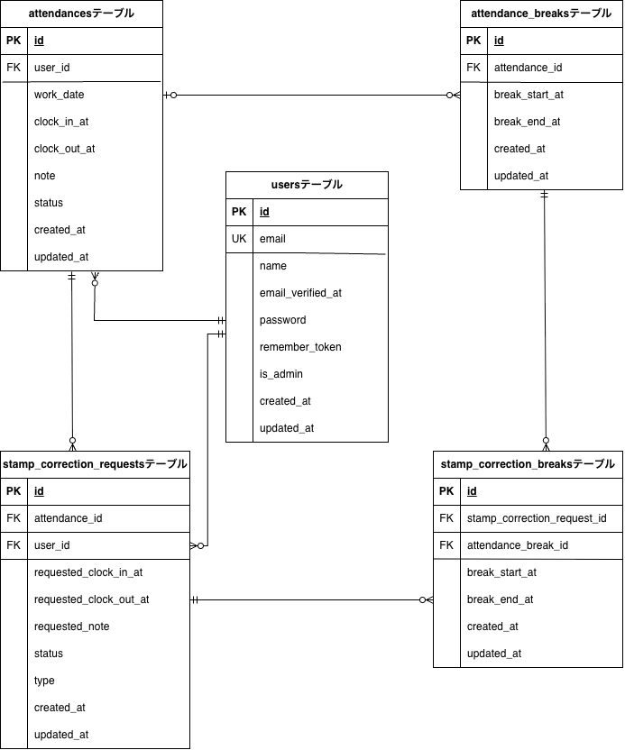

# coachtech勤怠管理アプリ
## 概要
COACHTECHの模擬案件として制作した勤怠アプリです。

本アプリケーションは、
スタッフの勤怠打刻・勤怠修正申請・管理者承認を行う
勤怠管理システムです。

一般ユーザーと管理者の権限を分離し、

- 勤怠打刻
- 修正申請
- 管理者承認
- 勤怠管理

を行うことができます。
※ 本READMEは、環境構築手順・動作確認方法・設計資料の参照を目的として記載しています。

## 環境構築手順

## 1 リポジトリのクローン

```bash
git clone git@github.com:yurinaniko/coachtech-attendance-app.git
cd coachtech-attendance-app
```

## 2 Docker 起動

```bash
docker compose up -d --build
```

## 3 PHP コンテナに入る

```bash
docker compose exec php bash
```

## 4 依存関係のインストール（Composer）

```bash
composer install
```

## 5 .env ファイル作成

```bash
cp .env.example .env
php artisan key:generate
```

## 6 .env 設定

### ① アプリケーション設定

```env
APP_NAME=coachtech勤怠管理アプリ
APP_ENV=local
APP_DEBUG=true
APP_URL=http://localhost
```

### ② データベース設定（Docker）

```env
DB_CONNECTION=mysql
DB_HOST=mysql
DB_PORT=3306
DB_DATABASE=laravel_db
DB_USERNAME=laravel_user
DB_PASSWORD=laravel_pass
```

### ③　 メール設定（MailHog）

```env
MAIL_MAILER=smtp
MAIL_HOST=mailhog
MAIL_PORT=1025
MAIL_USERNAME=null
MAIL_PASSWORD=null
MAIL_ENCRYPTION=null
MAIL_FROM_ADDRESS=test@example.com
MAIL_FROM_NAME="coachtech勤怠管理アプリ"
```

## 7 データベース初期化（マイグレーション & シーディング）

```bash
php artisan migrate:fresh --seed
```

## 8 アプリケーション確認

以下のURLにアクセスすると、アプリケーションが表示されます。

```
http://localhost:8000
```

## 備考

※（M1 / M2 Mac）
本プロジェクトでは、Apple Silicon（M1 / M2 Mac）環境でも
問題なく動作するよう、docker-compose.yml にて
ARM64 対応の Docker image を使用しています。

```yaml
mysql:
  image: arm64v8/mysql:8.0
  platform: linux/arm64/v8
```

そのため、M1 / M2 Mac 環境でも
追加設定なしで Docker を起動できます。

## 動作確認用アカウント

Seeder により以下のテストユーザーを用意しています。

### ■ 管理者

メールアドレス: admin@example.com
パスワード: password123

### ■ 一般ユーザー

メールアドレス：user@example.com
パスワード：password456

※ テストを円滑に行うため、Seeder 側で メール認証済み状態 にしています。
ログイン画面からお試しください。

## 認証設計について

本アプリでは、管理者・一般ユーザーともに
Laravelの標準 web ガードを使用しています。

そのため、同一ブラウザ内では
管理者と一般ユーザーの同時ログインはできません。

動作確認を行う際は、

- 一般ユーザー：通常ブラウザ
- 管理者：別ブラウザ（またはシークレットウィンドウ）

でログインしてください。

※ 課題要件上、ガード分離は行っていません。
将来的には guard を分離する設計も可能ですが、
本課題では要件に合わせてシンプルな構成としています。


### メール認証（MailHog）

開発環境では MailHog を使用しています。

```
アプリ： http://localhost:8000

MailHog： http://localhost:8025
```

メール認証・通知メールは MailHog 上で確認できます。
メール認証誘導画面の「認証はこちらから」ボタンを押すと、
MailHog の画面へ遷移します。

## テストについて
本アプリケーションでは PHPUnit を用いた機能テスト（Feature Test）を実装しています。

主に以下の観点でテストを行っています。

- 認証機能
（会員登録 / ログイン / ログアウト / メール認証）

- 勤怠機能
（出勤 / 休憩 / 退勤 / ステータス管理）

- 勤怠一覧・詳細表示

- 修正申請機能

各機能について、
正常系と異常系（バリデーション / 権限制御 / 未ログイン時の挙動）を中心にテストを実装しています。

※ テスト実行時は phpunit.xml にて、
キャッシュ / セッション / メール等をテスト用設定へ切り替えています。

## テスト実行手順
※ 本アプリケーションでは、本番データへの影響を防ぐため
テスト専用データベースを使用しています。
本アプリケーションでは PHPUnit を使用しています。
テスト実行時は `.env.testing` の設定が使用されます。

1. テスト用データベースを作成
上記で指定した DB_DATABASE（例：laravel_test）を、
MySQL 上に作成してください。
```bash
docker compose exec mysql bash
mysql -u root -p
```
```sql
CREATE DATABASE laravel_test;
SHOW DATABASES;
```
SHOW DATABASES;入力後、laravel_testが作成されていれば成功です。

2. configファイルの変更
configディレクトリの中のdatabase.phpに以下の編集を行う。
```env
'mysql' => [
// 中略
],
+  'mysql_test' => [
+      'driver' => 'mysql',
+      'host' => env('DB_HOST', 'mysql'),
+      'port' => env('DB_PORT', '3306'),
+      'database' => 'laravel_test',
+      'username' => 'root',
+      'password' => 'root',
+      'charset' => 'utf8mb4',
+      'collation' => 'utf8mb4_unicode_ci',
+      'prefix' => '',
+      'strict' => true,
+      ],
```
3. `.env.testing` を作成
```bash
cp .env .env.testing
```
4. .env.testing をテスト用に編集
### ① アプリケーション設定
```env
APP_ENV=test
APP_KEY=
```

### ② データベース設定（Docker）

```env
DB_CONNECTION=mysql_test
DB_HOST=mysql
DB_PORT=3306
DB_DATABASE=laravel_test
DB_USERNAME=root
DB_PASSWORD=root

※ DBユーザー名・パスワードは、ご自身の環境に合わせて設定してください。
```
APP_KEY は空に設定してください。
編集後、以下のコマンドでテスト用キーを生成します。

```bash
php artisan key:generate --env=testing
php artisan config:clear
```

5. PHPUnit 設定
テスト実行時は .env.testing の設定に加えて、
phpunit.xml にてテスト環境用の設定を定義しています。
```xml
<server name="APP_ENV" value="testing"/>
<server name="DB_CONNECTION" value="mysql_test"/>
<server name="DB_DATABASE" value="laravel_test"/>
```
これにより
・テスト実行時のみテスト用DBを使用
・本番 / 開発DBへ影響しない安全な設計
となっています。

6. マイグレーション & テスト実行
```bash
php artisan migrate:fresh --env=testing
php artisan test
```
Docker 環境上でテストを実行し、
すべてのテストが PASS することを確認しています。

## 使用技術

- 種類 バージョン
- PHP 8.x
- Laravel 8.x
- Laravel Fortify（認証機能）
- MySQL 8.0
- Nginx 1.25
- Docker / Docker Compose 最新
- MailHog 開発用
- phpMyAdmin 使用

## 機能一覧
※ 本アプリケーションでは、管理者・一般ユーザー間で
利用可能機能を権限により制御しています。

### 一般ユーザーが使用できる機能
- 会員登録
- ログイン機能
- 勤怠打刻機能
- 休憩打刻機能
- 勤怠一覧表示
- 勤怠詳細表示
- 勤怠修正申請機能

---

### 管理者が使用できる機能
- ログイン機能
- 勤怠一覧表示
- 勤怠詳細表示
- スタッフ一覧表示
- スタッフ別勤怠一覧表示
- 勤怠データCSV出力
- 申請一覧表示
- 修正申請承認機能

## 実装した応用機能

- メール認証機能（mailhog）
- 認証メール再送機能
- CSV出力機能
  管理者画面から、スタッフの勤怠データをCSV形式でダウンロード可能

  ## 画面状態遷移仕様

### ■ 修正申請フロー

1. 一般ユーザーが修正申請を行うと
   `stamp_correction_requests.status = pending`（承認待ち）となる。

2. 管理者が以下のいずれかを実行した場合

- 修正申請承認画面で「承認」ボタンを押下
- 勤怠詳細画面で直接修正を実施

→ `attendances` テーブルを更新し
→ `stamp_correction_requests.status = approved`（承認済み）とする。

3. 承認済みの申請は申請一覧画面の「承認済み」タブに表示される。

4. 承認後は一般ユーザー・管理者いずれも再度修正を行うことができる。
その場合、新規の `stamp_correction_requests` レコードを作成し、修正履歴として保存する。


### ■ 承認前の表示仕様

修正申請が **pending（承認待ち）状態の間は、**

- 一般ユーザーの勤怠一覧
- 一般ユーザーの勤怠詳細
- 管理者の勤怠一覧
- 管理者の勤怠詳細

には **修正前の勤怠データを表示**します。

管理者が承認した時点で `attendances` テーブルが更新され、
その後の勤怠一覧・勤怠詳細には **修正後の勤怠データが表示されます。**


### ■ 修正申請の履歴について

本アプリでは以下のようにデータを管理しています。

- 勤怠の最終確定値
  → `attendances` テーブル

- 修正申請の履歴
  → `stamp_correction_requests` テーブル

同一日付に対して一般ユーザーが複数回修正申請を行った場合でも、
各申請は **個別レコードとして保存し履歴として保持**します。

`attendances` テーブルには
**承認後の最終確定データのみが反映される設計**としています。


### ■ 未来日の挙動

未来日の勤怠データは存在しないため、

- 詳細画面では入力フィールドを表示しない
- 修正ボタンは非表示

とし、編集不可の静的表示としています。

### 仕様詳細

## バリデーションについて
本アプリケーションでは Laravel FormRequest を使用しています。
未入力時や入力規則違反時には、
各項目ごとにエラーメッセージを表示する仕様です。

- 出勤時間が退勤時間より後の場合エラー
- 休憩開始・終了の不整合時エラー
- 備考未入力時エラー

## ER 図



## テーブル仕様

本アプリのテーブル設計は以下のドキュメントにまとめています。
- 公開用テーブル仕様書
https://docs.google.com/spreadsheets/d/1AY8TRv97TYBJxCM7kKxkW6QKjJcpF8YWIsPi0b7tbLY/edit?usp=sharing
## ルート・コントローラー・ビュー構成

画面ごとのルーティング、コントローラー、アクション対応、ビュー、バリデーションは
以下のドキュメントにまとめています。
- 公開用ルート・コントローラー・バリデーション一覧・ビュー
https://docs.google.com/spreadsheets/d/1FC0Pf3dNr8WjfnQI_Lchf6kHCBhUjMCTPb79vkDoZIA/edit?usp=sharing

### キー設計について
本アプリケーションでは、データ整合性を担保するために
Unique Key（UK） および Foreign Key（FK） を適切に設定しています。
■ Unique Key（UK）
Unique Key は、
同一値の重複登録を防ぐための制約
として使用しています。
本アプリでは以下に適用しています。
- users テーブル

  email

これにより、

✔ 同一メールアドレスでの複数登録を防止
✔ 認証基盤としての一意性を保証
✔ ログイン認証時のユーザー識別キーとして使用

を実現しています。

■ Foreign Key（FK / 外部キー / FRキー）
Foreign Key は、
テーブル間の参照整合性を保証する制約
として使用しています。
本アプリでは、勤怠データのリレーション構造に基づき
以下の関連付けを行っています。

✔ attendances テーブル

user_id → users.id

勤怠は必ず既存ユーザーに紐づく

✔ attendance_breaks テーブル

attendance_id → attendances.id

休憩は必ず既存勤怠に紐づく

✔ stamp_correction_requests テーブル

attendance_id → attendances.id

user_id → users.id

修正申請は対象勤怠＋申請者に紐づく

✔ stamp_correction_breaks テーブル

stamp_correction_request_id → stamp_correction_requests.id

attendance_break_id → attendance_breaks.id

修正申請内の休憩データを保証

■ 複合ユニークキーについて
本アプリケーションでは、勤怠データの性質を考慮し
複合ユニークキー（Composite Unique Key） を採用しています。

- 対象テーブル
attendances テーブル
```php
$table->unique(['user_id', 'work_date']);
```

(設計意図)

勤怠データは業務ルール上、
「1ユーザー × 1日 = 1レコード」
である必要があります。

この制約により：

✔ 同一日に複数勤怠が作成されることを防止
✔ データ重複の論理的破綻を回避
✔ アプリ側での重複チェック処理を簡素化
✔ DBレベルで業務ルールを保証

を実現しています。

■ type カラムの設計意図
stamp_correction_requests テーブルでは、
修正データの発生源を明確化するために
type カラムを追加しています。
(カラム仕様)
カラム名：type
値：
```php
TYPE_USER  = 'user';
TYPE_ADMIN = 'admin';
```
type は、
「誰が修正データを作成したか」
を識別するための属性です。
(導入背景)
本アプリでは修正データが以下2経路で発生します：

✔ 一般ユーザーによる修正申請
✔ 管理者による直接修正

この2つは業務的に意味が異なるため、
DBレベルで区別可能にしています。

■ status カラムの設計意図
本アプリケーションでは、勤怠データおよび修正申請データの状態管理のため
status カラムを採用しています。
status は、
「レコードの業務上の状態」
を表す属性です。
(ステータス定義)
本アプリケーションでは以下の状態を採用しています。
- stamp_correction_requests.status
  修正申請の状態を管理するカラム

値	意味
```php
pending	  承認待ち状態
approved	承認済み状態
```
(設計背景)
勤怠システムでは、

✔ 修正が未確定の状態
✔ 管理者確認済みの状態

を明確に区別する必要があります。
この業務仕様を DB レベルで表現するため
status カラムを導入しています。
- attendances.status
  勤務状態を管理するカラム
  また attendances テーブルにも status カラムを設け、
  勤務状態の管理を行う設計としています。

  現在の実装では clock_in_at・clock_out_at・休憩情報から
  勤務状態を算出するロジックを使用していますが、
  将来的に
  ・状態による検索
  ・勤務状態の集計
  ・管理画面の絞り込み

  などを行う可能性を考え、
  状態をDBとして保持できる設計としています。

